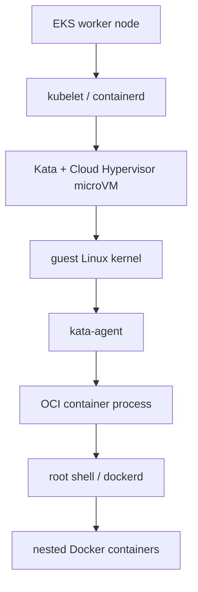
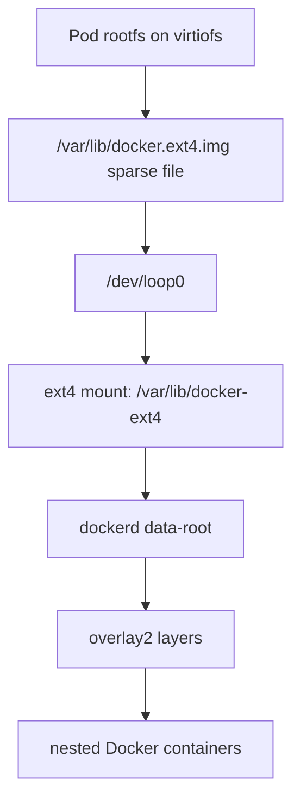
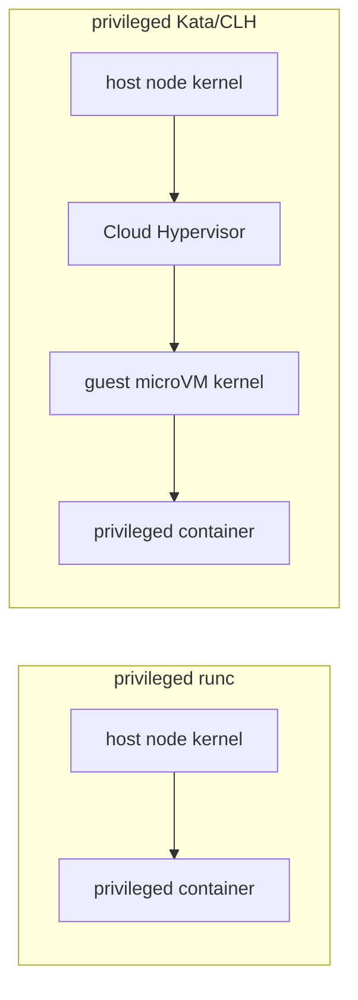

# Learnings: Docker-in-Docker on EKS + Kata Containers + Cloud Hypervisor

## Table of Contents

1. [Executive Summary](#1-executive-summary)
2. [Environment and Goal](#2-environment-and-goal)
3. [Mental Model: Kata/CLH Is VM Isolation with Container Semantics](#3-mental-model-kataclh-is-vm-isolation-with-container-semantics)
4. [Why Docker Initially Failed](#4-why-docker-initially-failed)
5. [Storage Problem: `virtiofs` vs Docker `overlay2`](#5-storage-problem-virtiofs-vs-docker-overlay2)
6. [Storage Fix: Loop-Backed ext4 Docker Data Root](#6-storage-fix-loop-backed-ext4-docker-data-root)
7. [Container Startup: ENTRYPOINT vs Kubernetes `command` and `args`](#7-container-startup-entrypoint-vs-kubernetes-command-and-args)
8. [Capabilities, Privileged Mode, and Why Root Is Not Enough](#8-capabilities-privileged-mode-and-why-root-is-not-enough)
9. [Docker Networking, `ip_forward`, and Kubernetes Sysctls](#9-docker-networking-ip_forward-and-kubernetes-sysctls)
10. [Fine-Grained Mode vs Privileged Kata Mode](#10-fine-grained-mode-vs-privileged-kata-mode)
11. [Why Privileged Kata Is Safer Than Privileged runc](#11-why-privileged-kata-is-safer-than-privileged-runc)
12. [DNSMasq Compose Test](#12-dnsmasq-compose-test)
13. [Image and Repository Changes](#13-image-and-repository-changes)
14. [Recommended Kubernetes Manifests](#14-recommended-kubernetes-manifests)
15. [Troubleshooting Playbook](#15-troubleshooting-playbook)
16. [Key Takeaways](#16-key-takeaways)
17. [External Validation References](#17-external-validation-references)

---

## 1. Executive Summary

We ran Docker-in-Docker inside an EKS pod backed by Kata Containers and Cloud Hypervisor. The environment provides a real microVM isolation boundary, but Kubernetes still launches the workload as an OCI container inside that microVM.

The main issues discovered were:

1. Docker's default `overlay2` storage failed because the pod root filesystem and `/var/lib/docker` were on `virtiofs`.
2. Docker needed a real Linux filesystem with overlayfs-compatible upper/work directories.
3. A loop-backed sparse ext4 image mounted at `/var/lib/docker-ext4` solved the storage problem.
4. Fine-grained Kubernetes security needed capabilities such as `SYS_ADMIN`, `MKNOD`, `NET_ADMIN`, and `NET_RAW`.
5. Docker networking failed when `dockerd` tried to write `/proc/sys/net/ipv4/ip_forward`, because Kubernetes exposed that sysctl as read-only.
6. The image was patched to support `DOCKER_IP_FORWARD=false` by default, with `DOCKER_IP_FORWARD=true` for privileged Kata mode.
7. Kubernetes `command:` overrides Docker `ENTRYPOINT`, so using `command: ["sleep", "infinity"]` prevented `start-docker.sh` from running. The fix is to use `args:` or explicitly call the entrypoint.

The final working image is:

```bash
ghcr.io/vmatrix/ubuntu-dind:kata-ext4
```

The source repo is:

```text
https://github.com/vmatrix/ubuntu-dind
```

---

## 2. Environment and Goal

### Environment

```text
EKS worker node
  └─ Kata Containers runtime
      └─ Cloud Hypervisor microVM
          └─ Ubuntu Docker-in-Docker container
              └─ dockerd
                  └─ nested Docker containers
```

### Goal

Run a Docker daemon inside the pod and then run nested Docker workloads, including a Compose stack like:

```yaml
services:
  dnsmasq:
    image: jpillora/dnsmasq:latest
  web_app:
    image: nginx:alpine
```

This tests:

1. Docker daemon startup inside Kata/CLH.
2. Docker storage driver behavior.
3. Docker bridge networking.
4. Static Docker container IPs.
5. Local DNS resolution through `dnsmasq`.
6. Port publishing on TCP/UDP 53.

---

## 3. Mental Model: Kata/CLH Is VM Isolation with Container Semantics

A common misconception is:

```text
Kata pod == normal VM where root can do anything
```

The more accurate model is:

```text
Kata pod == Kubernetes/OCI container UX + microVM isolation boundary
```

ASCII diagram:

```text
+-------------------------------------------------------+
| EKS worker node                                       |
|                                                       |
|  kubelet + containerd                                 |
|         |                                             |
|         v                                             |
|  +-----------------------------------------------+    |
|  | Cloud Hypervisor microVM                       |    |
|  |                                               |    |
|  |  guest Linux kernel                            |    |
|  |       |                                       |    |
|  |       v                                       |    |
|  |  kata-agent                                   |    |
|  |       |                                       |    |
|  |       v                                       |    |
|  |  OCI container process                         |    |
|  |       |                                       |    |
|  |       v                                       |    |
|  |  root shell / dockerd                          |    |
|  +-----------------------------------------------+    |
+-------------------------------------------------------+
```

The container still has:

- Linux capability bounding set
- seccomp policy
- AppArmor/SELinux profile, if enabled
- cgroup limits
- device access restrictions
- masked/read-only `/proc` paths
- Kubernetes sysctl policy

So root inside the container is **not automatically unrestricted root of the microVM**.

Mermaid version:



---

## 4. Why Docker Initially Failed

Initial `dockerd` could start, but running a container failed with an overlay mount error:

```text
failed to mount ... fstype: overlay ... err: invalid argument
overlayfs: upper fs missing required features
```

Kernel log showed:

```text
overlayfs: upper fs does not support tmpfile.
overlayfs: failed to set xattr on upper
overlayfs: upper fs missing required features.
```

The relevant mount layout showed the pod root and Docker data directory were on `virtiofs`:

```text
none on / type virtiofs
none on /var/lib/docker type virtiofs
```

Docker's `overlay2` storage driver needs a backing filesystem that supports overlayfs upperdir/workdir semantics. In this environment, `virtiofs` did not provide the required features.

---

## 5. Storage Problem: `virtiofs` vs Docker `overlay2`

Docker `overlay2` works roughly like this:

```text
lowerdir = read-only image layers
upperdir = container writable layer
workdir  = overlayfs working directory
merged   = final container rootfs view
```

ASCII diagram:

```text
Docker image layer A  ----+
Docker image layer B  ----+--> overlayfs --> container rootfs
Docker image layer C  ----+        ^
                                  |
container writable upperdir -------+
workdir ---------------------------+
```

The upperdir and workdir must be on a filesystem that supports required overlayfs features. `virtiofs` in this setup was not suitable.

Problem path:

```text
/var/lib/docker
  └─ overlay2 upperdir/workdir on virtiofs
      └─ overlay mount fails
```

---

## 6. Storage Fix: Loop-Backed ext4 Docker Data Root

The fix was to create a sparse ext4 image file and mount it inside the container. Docker then uses that ext4 filesystem as its data root.

Final storage architecture:

```text
virtiofs root filesystem
  └─ /var/lib/docker.ext4.img       sparse file
       └─ /dev/loop0               loop device
            └─ ext4 mount
                 └─ /var/lib/docker-ext4
                      └─ Docker data root using overlay2
```

ASCII diagram:

```text
+---------------------------------------------------+
| Pod rootfs on virtiofs                            |
|                                                   |
|  /var/lib/docker.ext4.img                         |
|           |                                       |
|           v                                       |
|      /dev/loop0                                   |
|           |                                       |
|           v                                       |
|  ext4 mount at /var/lib/docker-ext4               |
|           |                                       |
|           v                                       |
|  Docker overlay2 layers and container data         |
+---------------------------------------------------+
```

Mermaid diagram:



The generated Docker daemon config is:

```json
{
  "data-root": "/var/lib/docker-ext4",
  "storage-driver": "overlay2",
  "ip-forward": false
}
```

`start-docker.sh` performs:

1. Create missing loop device nodes, if needed.
2. Create `/var/lib/docker.ext4.img` as a sparse file, default `20G`.
3. Format it as ext4.
4. Attach it to a loop device.
5. Mount it at `/var/lib/docker-ext4`.
6. Generate `/etc/docker/daemon.json`.
7. Start `dockerd` through supervisor.
8. Wait for `docker info` to succeed.

Important environment variables:

```bash
DOCKER_EXT4_IMG=/var/lib/docker.ext4.img
DOCKER_EXT4_SIZE=20G
DOCKER_DATA_ROOT=/var/lib/docker-ext4
DOCKER_STORAGE_DRIVER=overlay2
DOCKER_IP_FORWARD=false
```

---

## 7. Container Startup: ENTRYPOINT vs Kubernetes `command` and `args`

The image has:

```Dockerfile
ENTRYPOINT ["entrypoint.sh"]
CMD ["bash"]
```

`entrypoint.sh` does:

```bash
start-docker.sh
"$@"
```

Therefore, Docker should start automatically when the container starts.

However, Kubernetes has an important behavior:

```yaml
command:
  - sleep
  - infinity
```

This overrides the image `ENTRYPOINT`, so `entrypoint.sh` never runs and Docker never starts.

Wrong:

```yaml
containers:
  - name: ubuntu-dind
    image: ghcr.io/vmatrix/ubuntu-dind:kata-ext4
    command:
      - sleep
      - infinity
```

Correct:

```yaml
containers:
  - name: ubuntu-dind
    image: ghcr.io/vmatrix/ubuntu-dind:kata-ext4
    args:
      - sleep
      - infinity
```

Also correct if `command` must be used:

```yaml
containers:
  - name: ubuntu-dind
    image: ghcr.io/vmatrix/ubuntu-dind:kata-ext4
    command:
      - /usr/local/bin/entrypoint.sh
    args:
      - sleep
      - infinity
```

Symptom when entrypoint is skipped:

```text
failed to connect to the docker API at unix:///var/run/docker.sock
connect: no such file or directory
```

Manual execution fixes it because it runs the skipped startup logic:

```bash
/usr/local/bin/start-docker.sh
```

---

## 8. Capabilities, Privileged Mode, and Why Root Is Not Enough

Root inside a container is not the same as unrestricted kernel root. Linux checks capabilities for privileged operations.

Examples:

| Operation | Requirement |
|---|---|
| `mount /dev/loop0 /var/lib/docker-ext4` | `CAP_SYS_ADMIN` |
| `mknod /dev/loop0` | `CAP_MKNOD` |
| bridge/veth/route/iptables | `CAP_NET_ADMIN` |
| raw sockets / packet operations | `CAP_NET_RAW` |
| resource limit operations | `CAP_SYS_RESOURCE` |
| mount syscall allowed | seccomp profile must allow it |

Initial mount failure:

```text
mount: /var/lib/docker-ext4: permission denied
```

This was caused by missing `SYS_ADMIN` or a restrictive seccomp/LSM profile.

Fine-grained capabilities tried:

```yaml
securityContext:
  privileged: false
  runAsUser: 0
  runAsGroup: 0
  allowPrivilegeEscalation: true
  seccompProfile:
    type: Unconfined
  capabilities:
    add:
      - SYS_ADMIN
      - NET_ADMIN
      - NET_RAW
      - MKNOD
      - SYS_RESOURCE
```

---

## 9. Docker Networking, `ip_forward`, and Kubernetes Sysctls

Docker bridge networking expects IPv4 forwarding to be enabled:

```text
/proc/sys/net/ipv4/ip_forward = 1
```

With fine-grained security, Docker failed because it tried to write this path:

```text
failed to set IP forwarding '/proc/sys/net/ipv4/ip_forward' = '1':
open /proc/sys/net/ipv4/ip_forward: read-only file system
```

The image was patched to default to:

```json
"ip-forward": false
```

This prevents `dockerd` from attempting to write the read-only sysctl. This helps Docker start in restricted Kata pods.

But if the actual kernel value remains `0`, Docker/Compose warns:

```text
IPv4 forwarding is disabled. Networking will not work.
```

For full Docker bridge/NAT behavior, the pod namespace needs:

```text
net.ipv4.ip_forward = 1
```

Kubernetes can set this at pod creation time:

```yaml
spec:
  securityContext:
    sysctls:
      - name: net.ipv4.ip_forward
        value: "1"
```

However, some clusters reject this as an unsafe sysctl unless kubelet/runtime policy allows it.

### Two modes

Fine-grained mode:

```bash
DOCKER_IP_FORWARD=false
```

Privileged Kata mode:

```bash
DOCKER_IP_FORWARD=true
```

In privileged mode, Docker can normally enable `ip_forward` successfully.

---

## 10. Fine-Grained Mode vs Privileged Kata Mode

### Fine-grained mode

Goal: avoid `privileged: true`.

Typical YAML:

```yaml
securityContext:
  privileged: false
  runAsUser: 0
  runAsGroup: 0
  allowPrivilegeEscalation: true
  seccompProfile:
    type: Unconfined
  capabilities:
    add:
      - SYS_ADMIN
      - NET_ADMIN
      - NET_RAW
      - MKNOD
      - SYS_RESOURCE
```

Potential pod-level sysctl:

```yaml
spec:
  securityContext:
    sysctls:
      - name: net.ipv4.ip_forward
        value: "1"
```

Pros:

- More least-privilege aligned.
- Better for restricted environments.

Cons:

- Docker-in-Docker touches many kernel features.
- You may hit one missing permission after another.
- Some sysctls/device operations may require cluster-level configuration.

### Privileged Kata mode

Goal: use the microVM as the isolation boundary and allow Docker to behave like it is in a VM.

Typical YAML:

```yaml
securityContext:
  privileged: true
  runAsUser: 0
  runAsGroup: 0
```

Use:

```yaml
env:
  - name: DOCKER_IP_FORWARD
    value: "true"
```

Pros:

- Much simpler.
- Docker networking, mounts, cgroups, and loop devices are more likely to work.
- Fits DinD's operational needs.

Cons:

- Powerful inside the microVM.
- Still not risk-free.
- Requires policy approval for privileged pods.

---

## 11. Why Privileged Kata Is Safer Than Privileged runc

### Privileged runc

With normal `runc`, containers share the host node kernel:

```text
+---------------------------------------------------+
| EKS worker node kernel                            |
|                                                   |
|  kubelet/containerd                               |
|  normal pods                                      |
|  privileged runc pod  <--- privileged here        |
|                                                   |
+---------------------------------------------------+
```

A privileged runc pod has broad powers against the same kernel used by the EKS node. This can affect host devices, mounts, networking, cgroups, and other kernel interfaces.

### Privileged Kata/CLH

With Kata, the pod is inside a microVM:

```text
+---------------------------------------------------+
| EKS worker node kernel                            |
|                                                   |
|  +---------------------------------------------+  |
|  | Cloud Hypervisor microVM                     |  |
|  |                                             |  |
|  |  guest Linux kernel                          |  |
|  |    privileged pod  <--- privileged here      |  |
|  |                                             |  |
|  +---------------------------------------------+  |
|                                                   |
+---------------------------------------------------+
```

The privileged workload is mostly privileged against the **guest microVM kernel**, not directly against the host node kernel.

Mermaid diagram:



Practical security interpretation:

```text
privileged runc:
  privileged against host kernel = high risk

privileged Kata:
  privileged inside microVM = smaller blast radius
```

Still, privileged Kata is not risk-free. It can fully compromise its own pod/microVM and anything mounted into it, and hypervisor/guest-kernel escapes are still theoretically possible.

---

## 12. DNSMasq Compose Test

The test Compose stack uses a safer subnet than `172.20.0.0/16` because many EKS clusters use `172.20.0.10` for Kubernetes DNS.

The example uses:

```text
172.31.0.0/16
```

Files:

```text
/opt/ubuntu-dind/examples/dnsmasq-compose/docker-compose.yml
/opt/ubuntu-dind/examples/dnsmasq-compose/dnsmasq.conf
```

Compose file:

```yaml
services:
  dnsmasq:
    image: jpillora/dnsmasq:latest
    container_name: local_dns
    volumes:
      - ./dnsmasq.conf:/etc/dnsmasq.conf:ro
    ports:
      - "53:53/udp"
      - "53:53/tcp"
    networks:
      dev_network:
        ipv4_address: 172.31.0.53

  web_app:
    image: nginx:alpine
    container_name: my_web_app
    dns:
      - 172.31.0.53
    networks:
      dev_network:
        ipv4_address: 172.31.0.10

networks:
  dev_network:
    ipam:
      config:
        - subnet: 172.31.0.0/16
```

DNSMasq config:

```conf
no-daemon
log-queries
log-facility=-
listen-address=0.0.0.0
bind-interfaces
server=1.1.1.1
server=8.8.8.8
address=/my-web-app.local/172.31.0.10
address=/web.local/172.31.0.10
```

Run:

```bash
cd /opt/ubuntu-dind/examples/dnsmasq-compose
docker compose up -d
```

Test DNS:

```bash
docker exec my_web_app nslookup my-web-app.local
```

Expected:

```text
Name: my-web-app.local
Address: 172.31.0.10
```

Test HTTP through DNS:

```bash
docker exec my_web_app wget -qO- http://my-web-app.local | head
```

Expected nginx HTML.

---

## 13. Image and Repository Changes

Repository:

```text
https://github.com/vmatrix/ubuntu-dind
```

Image:

```bash
ghcr.io/vmatrix/ubuntu-dind:kata-ext4
```

Explicit alias tag:

```bash
ghcr.io/vmatrix/ubuntu-dind:kata-ext4-ipforward-false
```

Important repo changes:

```text
Dockerfile
start-docker.sh
README.md
LEARNINGS.md
examples/dnsmasq-compose/README.md
examples/dnsmasq-compose/dnsmasq.conf
examples/dnsmasq-compose/docker-compose.yml
```

Dockerfile changes include:

- install `e2fsprogs`, `util-linux`, and `mount`
- add default `/etc/docker/daemon.json`
- copy dnsmasq Compose example into image

`start-docker.sh` changes include:

- create loop device nodes
- create sparse ext4 image
- mount ext4 data root
- generate daemon config
- support `DOCKER_IP_FORWARD`
- wait for Docker API readiness

---

## 14. Recommended Kubernetes Manifests

### Recommended for reliable DinD on Kata: privileged microVM mode

This is the simplest and most reliable configuration for Docker-in-Docker on Kata/CLH.

```yaml
apiVersion: v1
kind: Pod
metadata:
  name: ubuntu-dind-kata
spec:
  runtimeClassName: kata-clh

  containers:
    - name: ubuntu-dind
      image: ghcr.io/vmatrix/ubuntu-dind:kata-ext4
      imagePullPolicy: Always

      env:
        - name: DOCKER_IP_FORWARD
          value: "true"
        - name: DOCKER_EXT4_SIZE
          value: "20G"

      args:
        - sleep
        - infinity

      securityContext:
        privileged: true
        runAsUser: 0
        runAsGroup: 0
```

### Fine-grained experimental mode

```yaml
apiVersion: v1
kind: Pod
metadata:
  name: ubuntu-dind-kata
  annotations:
    container.apparmor.security.beta.kubernetes.io/ubuntu-dind: unconfined
spec:
  runtimeClassName: kata-clh

  securityContext:
    sysctls:
      - name: net.ipv4.ip_forward
        value: "1"

  containers:
    - name: ubuntu-dind
      image: ghcr.io/vmatrix/ubuntu-dind:kata-ext4
      imagePullPolicy: Always

      env:
        - name: DOCKER_IP_FORWARD
          value: "false"
        - name: DOCKER_EXT4_SIZE
          value: "20G"

      args:
        - sleep
        - infinity

      securityContext:
        privileged: false
        runAsUser: 0
        runAsGroup: 0
        allowPrivilegeEscalation: true
        seccompProfile:
          type: Unconfined
        capabilities:
          add:
            - SYS_ADMIN
            - NET_ADMIN
            - NET_RAW
            - MKNOD
            - SYS_RESOURCE
```

Note: if Kubernetes rejects `net.ipv4.ip_forward`, the cluster may need kubelet `allowed-unsafe-sysctls` configuration, or privileged Kata mode may be required.

---

## 15. Troubleshooting Playbook

### Docker socket missing

Symptom:

```text
Cannot connect to the Docker daemon at unix:///var/run/docker.sock
connect: no such file or directory
```

Check:

```bash
ps aux | grep -E 'dockerd|containerd|supervisord' | grep -v grep
```

Likely cause:

- Kubernetes `command:` overrode the image entrypoint.

Fix:

- use `args:` instead of `command:`
- or explicitly use `command: ["/usr/local/bin/entrypoint.sh"]`

### Mount permission denied

Symptom:

```text
mount: /var/lib/docker-ext4: permission denied
```

Cause:

- missing `SYS_ADMIN`
- seccomp blocking mount
- LSM restrictions

Fix:

```yaml
securityContext:
  seccompProfile:
    type: Unconfined
  capabilities:
    add:
      - SYS_ADMIN
      - MKNOD
```

Or use:

```yaml
securityContext:
  privileged: true
```

### Overlay mount invalid argument

Symptom:

```text
failed to mount ... fstype: overlay ... err: invalid argument
overlayfs: upper fs missing required features
```

Cause:

- Docker data root on `virtiofs`

Fix:

- use loop-backed ext4 data root at `/var/lib/docker-ext4`

### Docker dies on `ip_forward`

Symptom:

```text
failed to set IP forwarding '/proc/sys/net/ipv4/ip_forward' = '1':
open /proc/sys/net/ipv4/ip_forward: read-only file system
```

Fix for restricted mode:

```bash
DOCKER_IP_FORWARD=false
```

Fix for full Docker networking:

```yaml
spec:
  securityContext:
    sysctls:
      - name: net.ipv4.ip_forward
        value: "1"
```

Or use privileged Kata mode:

```yaml
securityContext:
  privileged: true
```

and:

```yaml
env:
  - name: DOCKER_IP_FORWARD
    value: "true"
```

### Compose warns IPv4 forwarding disabled

Symptom:

```text
IPv4 forwarding is disabled. Networking will not work.
```

Check:

```bash
cat /proc/sys/net/ipv4/ip_forward
```

If `0`, full Docker networking is degraded.

Fix:

- pod sysctl `net.ipv4.ip_forward=1`
- or privileged Kata mode with `DOCKER_IP_FORWARD=true`

### AppArmor annotation container not found

Symptom:

```text
metadata.annotations[container.apparmor.security.beta.kubernetes.io/ubuntu-dind]:
Invalid value: "ubuntu-dind": container not found
```

Cause:

The annotation suffix must match the exact container name.

Correct:

```yaml
metadata:
  annotations:
    container.apparmor.security.beta.kubernetes.io/ubuntu-dind: unconfined
spec:
  containers:
    - name: ubuntu-dind
```

---

## 16. Key Takeaways

1. Kata/CLH provides microVM isolation, but Kubernetes still applies container security semantics.
2. Root inside the pod is not unrestricted VM root.
3. Docker-in-Docker is kernel-feature heavy: mounts, cgroups, bridge networking, iptables, sysctls, and devices.
4. `virtiofs` is not a suitable Docker `overlay2` upperdir/workdir backing filesystem in this setup.
5. Loop-backed ext4 provides an overlayfs-compatible Docker data root.
6. Kubernetes `command:` overrides image `ENTRYPOINT`; use `args:` to keep startup logic.
7. Fine-grained DinD is possible but painful and cluster-policy dependent.
8. Privileged DinD under Kata/CLH is much safer than privileged DinD under runc because the blast radius is mostly the microVM.
9. For reliable Docker bridge networking, ensure `net.ipv4.ip_forward=1` or run privileged Kata mode with `DOCKER_IP_FORWARD=true`.
10. The final image supports both modes through environment variables.

Recommended production/dev-test stance for this specific use case:

```text
Use Kata/CLH as the isolation boundary.
Run the DinD pod privileged inside that microVM.
Set DOCKER_IP_FORWARD=true.
Use loop-backed ext4 Docker data root.
```

---

## 17. External Validation References

The findings in this document were validated against upstream documentation and issue reports:

1. **Kata Containers isolation model**
   - Kata describes itself as lightweight VMs that feel like containers while providing VM-style workload isolation.
   - Kata's design docs describe a guest Linux kernel inside a lightweight VM, with Kubernetes pod sandboxes implemented using VMs.
   - This validates the mental model: Kata/CLH provides VM isolation, but the workload is still launched through Kubernetes/OCI container semantics.
   - References:
     - https://github.com/kata-containers/kata-containers/blob/main/docs/design/virtualization.md
     - https://github.com/kata-containers/kata-containers/blob/main/docs/threat-model/threat-model.md

2. **Privileged Kata vs privileged runc**
   - Kata's own limitations and privileged-container docs state privileged support differs from `runc`: elevated capabilities are applied inside the guest, and host device handling differs from normal privileged containers.
   - Kata warns privileged mode can reduce security if misconfigured, so the correct claim is not "safe", but "safer blast radius than privileged runc because the guest VM is an additional isolation boundary".
   - References:
     - https://github.com/kata-containers/kata-containers/blob/main/docs/Limitations.md
     - https://github.com/kata-containers/kata-containers/blob/main/docs/how-to/privileged.md

3. **Docker + Kata + virtiofs storage problem**
   - Kata documents that Docker containers under Kata need care because mounts can be `kataShared` / `virtiofs`.
   - Existing Kata issue reports show Docker-in-Docker with virtio-fs hitting `overlay` mount `invalid argument` failures.
   - Docker's overlay2 docs require a compatible backing filesystem; for example, Docker documents specific backing filesystem requirements such as XFS `d_type=true`.
   - This validates the ext4 data-root workaround.
   - References:
     - https://github.com/kata-containers/kata-containers/blob/main/docs/how-to/how-to-run-docker-with-kata.md
     - https://github.com/kata-containers/runtime/issues/1888
     - https://docs.docker.com/engine/storage/drivers/overlayfs-driver/

4. **Kubernetes capabilities and why root is not enough**
   - Kubernetes securityContext docs describe adding Linux capabilities at the container level.
   - Linux `capabilities(7)` documents `CAP_SYS_ADMIN`, `CAP_MKNOD`, and `CAP_NET_ADMIN`; these map directly to the observed mount, device-node, and Docker networking requirements.
   - References:
     - https://kubernetes.io/docs/tasks/configure-pod-container/security-context/
     - https://man7.org/linux/man-pages/man7/capabilities.7.html

5. **Kubernetes sysctls and `net.ipv4.ip_forward`**
   - Kubernetes documents safe vs unsafe sysctls. `net.ipv4.ip_forward` is not in the default safe set and commonly requires kubelet `allowed-unsafe-sysctls` policy.
   - Kubernetes issue reports show pods failing with `SysctlForbidden` for `net.ipv4.ip_forward` unless it is whitelisted.
   - This validates why writing `/proc/sys/net/ipv4/ip_forward` from inside the pod can fail and why pod-level sysctls or privileged mode are needed.
   - References:
     - https://kubernetes.io/docs/tasks/administer-cluster/sysctl-cluster/
     - https://github.com/kubernetes/kubernetes/issues/92266

6. **Docker `ip-forward` and networking behavior**
   - Docker's `dockerd` docs expose `--ip-forward`, defaulting true, and Docker networking docs explain Docker enables IP forwarding for bridge networking when needed.
   - Docker networking docs and common Docker warnings validate the Compose warning: `IPv4 forwarding is disabled. Networking will not work.`
   - References:
     - https://docs.docker.com/reference/cli/dockerd/
     - https://github.com/moby/moby/blob/master/man/dockerd.8.md
     - https://docs.docker.com/engine/network/drivers/bridge/
     - https://github.com/docker/docs/blob/main/content/manuals/engine/network/packet-filtering-firewalls.md

7. **Kubernetes `command` and `args` behavior**
   - Kubernetes docs state container `command` and `args` override the image's default command and arguments.
   - This validates the observed behavior: using `command: ["sleep", "infinity"]` bypassed the image `ENTRYPOINT`, so `entrypoint.sh` and `start-docker.sh` did not run.
   - Reference:
     - https://kubernetes.io/docs/tasks/inject-data-application/define-command-argument-container/

Overall validation result: the content in this document is consistent with upstream Kata, Docker, Linux, and Kubernetes documentation. The main nuance is that privileged Kata should be described as **reduced host blast radius compared with privileged runc**, not as inherently safe.
